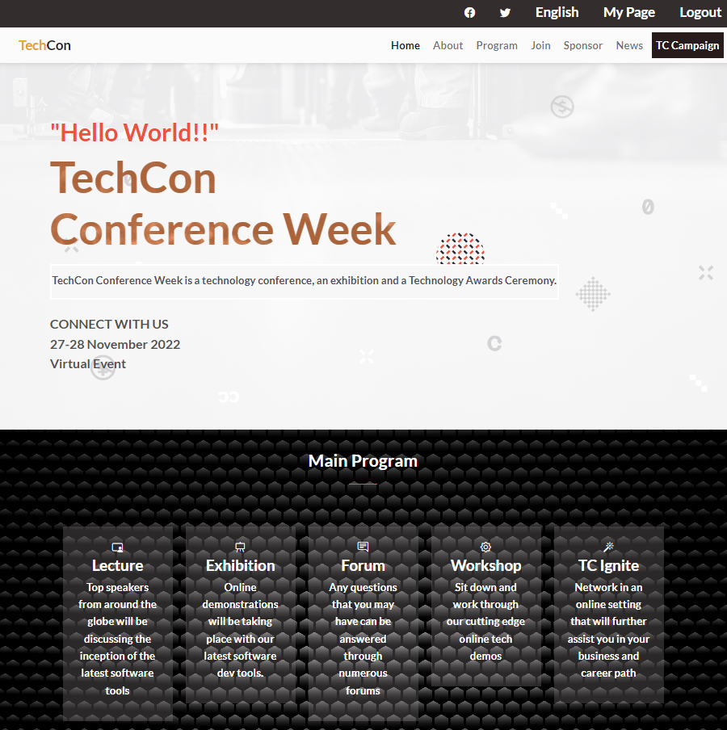

# Capstone Project

> This is a capstone project for module 1 in which a website is made for an online tech conference. The complete website is responsive and is made for 2 screen sizes i.e for mobile max width 768px and desktop 768px <. The featured speakers cards are displayed dynamically through JavaScript. Bootstrap was used throughout the entire design of the project as it made the design look better and minimised the CSS and Javascript used.

## Built With

- Major languages
  - Html
  - CSS
  - Javascript

- Technologies used
  - GitHub
  - Visual Studio Code
  - GitBash
  - WAVE chrome extension

## Project screenshot

## Authors

👤 **TayyabKM**

- Github: [@TayyabKM](https://github.com/TayyabKM)
- Twitter: [@TayyabI83126361](https://twitter.com/TayyabI83126361)
- Linkedin: [@tayyab-irfan-01b72b1aa](https://www.linkedin.com/in/tayyab-irfan-01b72b1aa/)

## 🤝 Contributing

Contributions, issues, and feature requests are welcome!

Feel free to check the [issues page](../../issues/).

## Show your support

⭐️⭐️⭐️⭐️⭐

## Acknowledgments

- Microverse
- A big thanks to Cindy Shin in Behance - (https://www.behance.net/adagio07)
- Photo acknowledgements:
- "https://www.vecteezy.com/free-vector/lines"- Lines Vectors by Vecteezy
- "https://www.freepik.com/free-vector/black-carbon-fiber-texture-background_6918300.htm#query=carbon%20fibre&position=0&from_view=keyword" - Image by starline on Freepik
- "https://unsplash.com/es/@alexkixa?utm_source=unsplash&utm_medium=referral&utm_content=creditCopyText" Alexandre Debiève
- "https://unsplash.com/s/photos/technology?utm_source=unsplash&utm_medium=referral&utm_content=creditCopyText" Unsplash
- "https://www.freepik.com/free-photo/remote-meeting-man-working-from-home-during-coronavirus-covid-19-quarantine-remote-office-concept_9367757.htm#query=virtual%20event&position=8&from_view=keyword" Image by master1305 on Freepik
- "https://www.freepik.com/free-photo/female-team-lead-chatting-with-coworkers-online-meeting-using-videocall-software-laptop-businesspeople-having-discussion-videoconference-telecommunications-remote-teamwork-concept_30770522.htm#query=virtual%20event&position=5&from_view=keyword">Image by DCStudio on Freepik
  
## 📝 License

This project is [MIT](./LICENSE) licensed.

